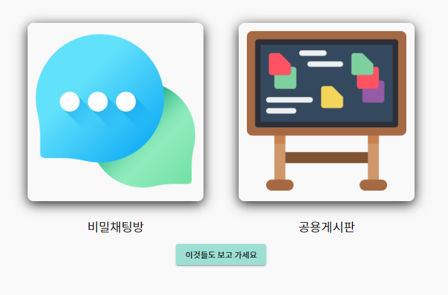
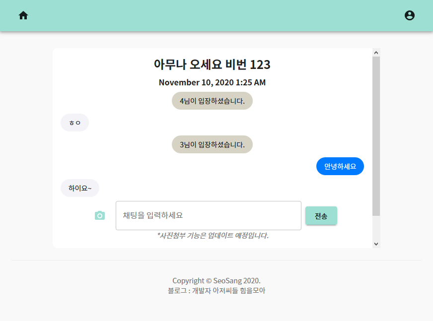
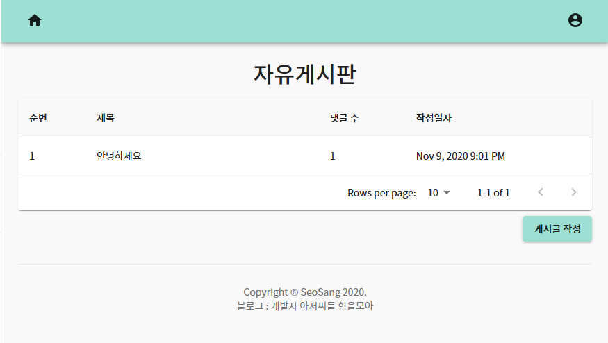

# Secreet Chatting Room & General Forum!

 

Secreet Chatting Room & General Forum!   
  (비밀채팅방 & 공용게시판)
   
  <a href="http://freechat-freeboard.ml/" target="_blank">Go!</a> 

 

  <a href="#chatting-room">채팅방</a> •
  <a href="#general-forum">게시판</a> •
  <a href="#tech-used">사용 기술</a> •
  <a href="#author">Author</a> •
  <a href="#license">License</a>

 

## 이용방법

[URL](http://freechat-freeboard.ml/) 접속!
  \*모든 서비스는 회원가입 및 로그인을 한 후에 이용 가능합니다.  
(https 가 아닌 http 를 이용하므로 보안에 취약합니다. 참고바랍니다.)

## Chatting-Room

## General-Forum

## Tech-Used

### Backend

- Architecture : Node js & TypeScript & Express
- DB : MySQL (Relational Database)
- Real-time Transmission : Socket.io (js)
- JWT Authentication

### Frontend

- Architecture : React & Next JS & TypeScript
- State Management : Mobx
- Design : Material-ui, styled-component

## Author

[SeoSang](https://github.com/SeoSang)

- Blog : programming119.tistory.com
- E-mail : ddrrpg@naver.com
- Site : https://i-am-seo-sang.vercel.app/

## License

MIT
